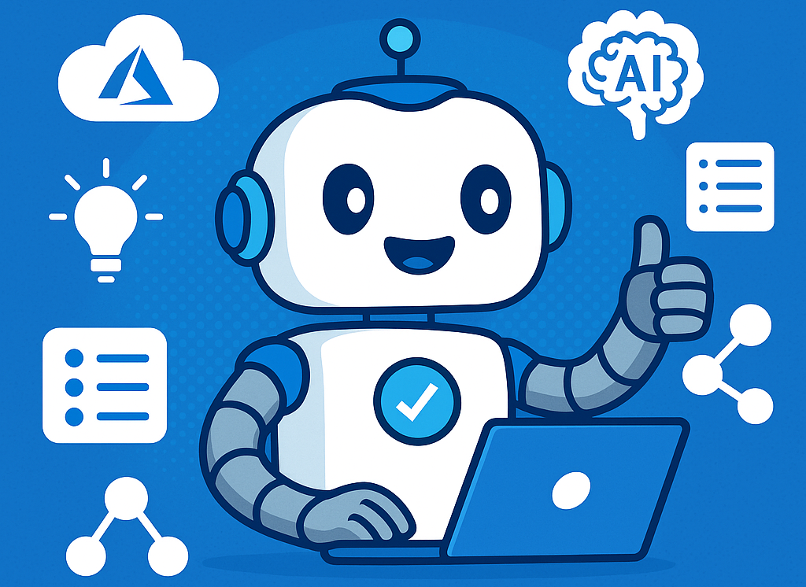

# Agentic AI App in a Day (Draft)

## Overview
- Duration: 9am to 4pm
- Demo: Azure Portal & VS Code
- Lab: GitHub Codespaces

### Goal

- Build on the Agentic AI aspects
- Inspire and Motivate 
- Real world ideas for Agentic AI
- Focused on End-to-end building AI-powered applications
- Frictionless learning environment, learn via lab, demo and teaching moments
- Azure AI Protections
- GitHub Copilot Agent Model to accelerate development
- For some people without laptops or limited technical skills, allowing them to watch walkthroughs, whilst others do them

### Audience
- Technical teams
- Senior management like C-levels

Note: some of the labs will be adjusted based on the resources and licences available for the participants to use.

## Presentation #1: Morning, Kick-start – 30 min
**Topics:** Basic Concepts and Overview
- Azure AI + Agentic AI overview  
- Agentic AI design patterns (Planning, Tool Use, Reflection, Multi-agent)  
- Agent architectures: ReAct, Chain-of-Thought
- Memory systems for agents (short-term, long-term, episodic)
- Tool integration patterns and API orchestration
- Intelligent data layers (Azure AI Search, RAG)  

## Demo #1: AI App Demo - 15min
**Showcasing a fun AI App**
- use a Accelerator Repo
- Daniel's LEGO coding chatbot app demo

## Lab #1: AI Foundry Integration & Extension - 50min
**Explore AI Foundry services:**
- Use Playground and Model Catalog 
- Various Azure AI Services
- Customize agent orchestration using no-code / low-code blocks (Functions)
- Connect additional tools and knowledge bases (e.g., a calculator API, web search API)
- Connect Agents

## Demo #2: Complex AI App Demo - 15min
***Demonstrating Advanced AI Solutions**
- use a Accelerator Repo
- refer to the repo list in the end

## Lab #2: Add Intelligent Data Layer - 50min
**Integrate Azure AI Search or Cosmos DB:**
- Ingest doc into Azure AI Search
- Use Document Intelligence Service
- Connect agent to knowledge base
- Demonstrate contextual reasoning
- Build a memory/retrieval plugin with Semantic Kernel
- Advance query, score profile, index, indexer in AI Search

## Presentation #2: After Lunch – 30 min
**Topic:** Building Production-Ready AI Apps with Agentic Concepts
- Technical Deep Dive: Advanced reasoning architectures and hybrid - approaches for complex problem-solving
- Platform-First Strategies: Scaling, API management, DevOps, and platform selection best practices
- Practical Considerations: Memory, cost, performance optimization - and error handling strategies
- Enterprise Readiness: Security, evaluation, testing, and compliance frameworks for production deployment
- Real-World Implementation Patterns: Customer service, document processing, developer tools, and multi-modal applications

## Demo #3: GitHub Copilot Coding Assistant for AI App - 15min
**Developer experience showcase:**
- Prompt-driven coding assistant (e.g., auto-generate unit tests, fix bugs)  
- Refactoring, adding comments/images, reformatting examples  
- Show how devs stay in control but move faster

## Lab #3: AI Agent 101 & Semantic Kernel + MCP - 70min
**Build and extend your first agentic AI app:**
- Implement the Prompt → Plan → Act → Reflect loop  
- Use Semantic Kernel for memory, planning, and tool integration  
- Chain outputs between tools and functions
- Build and integrate MCP for advanced orchestration and extensibility
- Experiment with adding new skills,

## Demo #4: Multi-Agent Solution Walkthrough - 15min
**Showcase advanced agent collaboration and orchestration:**
- Demonstrate multi-agent workflows using Azure AI Foundry Services
- Highlight agent collaboration: perception → planning → action loop
- Explore coordination strategies and communication between agents
- Present a real-world scenario (Daniel's agentic LEGO demo) to illustrate practical applications

## Lab #4: AI Integration, Deployment & Productionise - 70min
**Deploy and operationalize your agentic AI app:**
- Containerize the agent app for portability and scalability
- Deploy to Azure using ACA, AKS, or App Service with CI/CD
- Expose APIs securely via Azure API Management (auth, rate limits, monitoring)
- Implement logging, monitoring, and alerting for production readiness
- Apply security best practices and cost controls

## Presentation #3: Afternoon – 30 min
**Topic:** Wrap-Up: Responsible AI & Future Considerations
- Responsible AI and Guiderails: Content filtering, prompt injection defense, evaluation, and monitoring
- Observability & Operations: Agent analytics, performance metrics, cost tracking, and debugging
- Advanced Topics & Future Trends: Fine-tuning, multi-modal agents, edge deployment, and emerging frameworks
- Lessons Learned & Best Practices: Common pitfalls, testing strategies, and migration patterns
- Next Steps & Resources: Certification paths, community support, and building your first production agent

## Azure Services to be considered
- **Azure AI Foundry (Model Catalog, Playground)** – To explore and test models  
- **Azure AI Foundry – Agent Service** – For orchestrating multi-agent systems  
- **Azure AI Services** – For integrating vision, speech, etc.  
- **Azure OpenAI** – LLMs for chat, planning, coding, summarization  
- **Azure AI Search** – Intelligent data layer for RAG
- **APIM** – Secure, scalable API layer
- **Azure Functions** – Serverless compute for tool integration
- **Azure Logic Apps** – Workflow automation for tool orchestration
- **App Service / AKS / ACA** – App hosting  
- **Azure DevOps / GitHub Actions** – CI/CD for agent apps
- **Azure Monitor / Application Insights** – Monitoring and logging
- **Azure Key Vault** – Secure secrets management
- **Azure Storage / Cosmos DB** – Data storage for agent state and knowledge

## Dev toolchain to be considered
- **Semantic Kernel** – For agent memory, planning, and tool integration
- **Visual Studio Code** – IDE for development
- **Jupyter Notebooks** – For interactive data exploration and model testing
- **GitHub Codespaces** – Cloud-based dev environment for labs
- **GitHub or Azure DevOps** – Source control and CI/CD pipelines and project management
- **Azure CLI / PowerShell** – Command-line tools for Azure management
- **Bicep** – Infrastructure as Code for Azure resources

## Lab Exercise to be considered

- https://github.com/Azure-Samples/AI-Gateway
- https://github.com/microsoft/AI-For-Beginners
- https://github.com/microsoft/ai-agents-for-beginners

## Accelerator Repo to be considered
- https://github.com/Azure-Samples/get-started-with-ai-chat
- https://github.com/Azure-Samples/get-started-with-ai-agents
- https://github.com/microsoft/Multi-Agent-Custom-Automation-Engine-Solution-Accelerator
- https://github.com/microsoft/content-processing-solution-accelerator
- https://github.com/microsoft/document-generation-solution-accelerator
- https://github.com/microsoft/Build-your-own-copilot-Solution-Accelerator
- https://github.com/microsoft/Modernize-your-code-solution-accelerator
- https://github.com/Azure-Samples/Azure-Language-OpenAI-Conversational-Agent-Accelerator
- https://github.com/microsoft/Conversation-Knowledge-Mining-Solution-Accelerator

